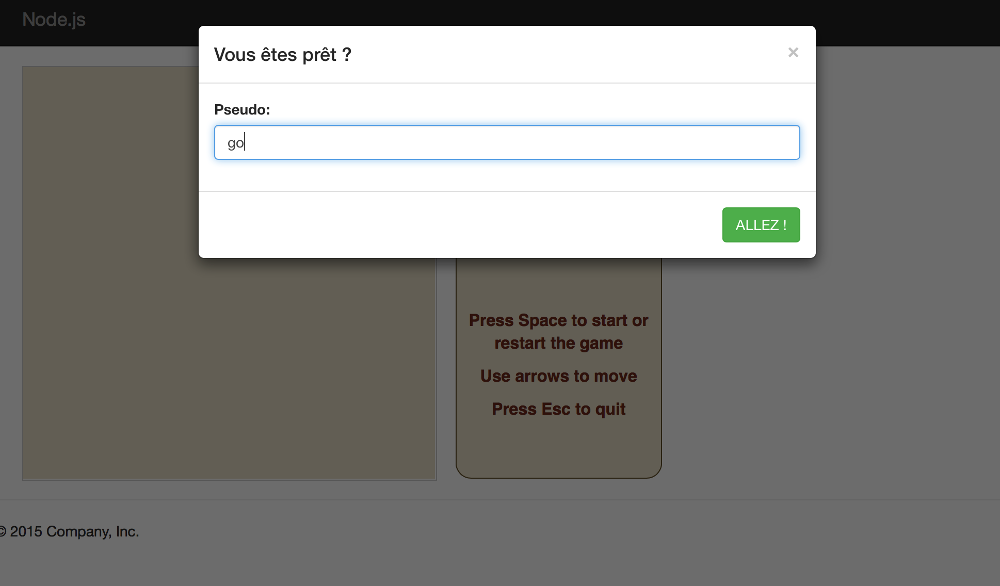
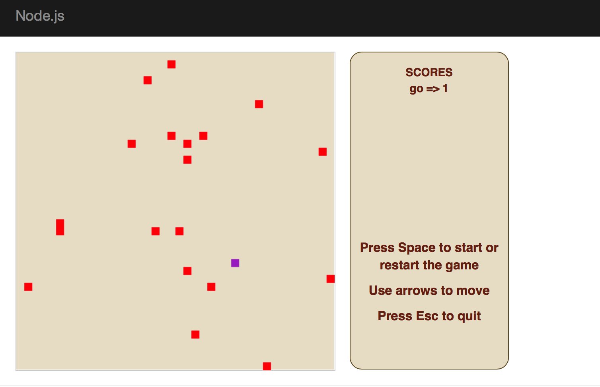

# Projet Jeu distribué [](https://travis-ci.com/qfdk/SR_GAME)

## Architecture 

Le jeux repose sur une architecture client/serveur.
Le serveur sera de type Node.js
Les techno utilisées : Node JS, Socket.io, Mocha, Git, Travis

## Dans ce Projet

```bash
├── README.md # reademe
├── config.js # config
├── lancer.js # test
├── node_modules # module downloaded
├── package.json 
├── public # static source
│   ├── css
│   ├── favicon.ico
│   ├── js
│   └── stylesheets
├── server.js # lancer
├── test
│   ├── test.js
│   ├── test2.js
│   └── testClients.js
└── views
```


## Lancement

```bash
git clone https://github.com/qfdk/SR_GAME.git
cd SR_GAME
npm install && npm start
```
Point your browser to `http://localhost:3000`

Enter your nickname then enjoy !




## Suppositions
Nous supposons que Node.js traite une requête à  la fois

## Structure de données
Une valeur de retour de type JSON 2 parties 

- Info Joueurs : position x et x, score
- Info Bonbon : Liste des positions

## API

* /getJoueurs : nombre de joueurs en ligne
> {size:5}

* message

```json
{
    msg: "ok", 
    joueurs: Array[1],
    bonbons: Array[20]
}
```

## Cas de tests

- Joueur : 2 joueurs peuvent pas être  à la même position
- Bonbon : A la fin du jeu, la somme des bonbons == la somme des scores

## Plan de travail

- Séance TP1(*/9)  : 
  - [x] Reflechir à une architecture

- Séance TP2(19/10)  : 
    - [x] Connexion des clients puis message "Hello World !"
    - [x] Génration de la structure de données (JSON) et envoie au client 
    - [x] Le client affiche le JSON

- Séance TP3  : 
    - [x] Mise en place de l'interface client 
    - [x] Gestion des deplacements

- Séance TP4  : 
    -  [X] Tests et Debug
    -  [X] Tests
    -  [X] Rapport

- Séance TP5  : 
    -  [X] Tests et Debug
    -  [X] Rapport

- Séance TP6 : 
    -  [ ] Tests et Debug
    -  [ ] Rapport